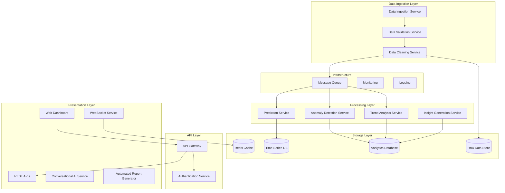

# Design Document: Nimbly EnrolmentAnalytics Dashboard

## Overview

The Nimbly EnrolmentAnalytics Dashboard is a comprehensive real-time analytics platform designed to identify meaningful patterns, trends, anomalies, and predictive indicators in Aadhaar enrolment and update data. The system follows a microservices architecture with event-driven processing to handle large-scale data analysis while ensuring security, scalability, and real-time insights.

The platform transforms raw Aadhaar data into actionable insights through advanced analytics, machine learning models, and interactive visualizations, enabling government agencies and policy makers to make informed decisions about digital identity infrastructure and welfare distribution.

## Architecture

### High-Level Architecture



### Microservices Architecture

The system is built using a microservices architecture with the following key principles:
- **Service Independence**: Each service can be developed, deployed, and scaled independently
- **Event-Driven Communication**: Services communicate through message queues for loose coupling
- **Data Consistency**: Each service manages its own data store with eventual consistency
- **Fault Tolerance**: Circuit breakers and retry mechanisms for resilient operations

## Components and Interfaces

### 1. Data Ingestion Service
**Purpose**: Handle large-scale data file uploads and initial processing

**Key Features**:
- Support for multiple file formats (CSV, JSON, Parquet)
- Chunked file processing for files up to 1GB
- Asynchronous processing with progress tracking
- Data format validation and schema enforcement

**Interface**:
```python
class DataIngestionService:
    def upload_file(self, file_path: str, metadata: dict) -> str
    def get_upload_status(self, upload_id: str) -> UploadStatus
    def validate_file_format(self, file_path: str) -> ValidationResult
```

### 2. Trend Analysis Service
**Purpose**: Identify patterns and trends in Aadhaar enrolment data

**Key Features**:
- Seasonal pattern detection using time series decomposition
- Geographic trend analysis with spatial clustering
- Demographic pattern recognition using statistical analysis
- Growth rate calculations with confidence intervals

**Machine Learning Models**:
- **Time Series Decomposition**: STL (Seasonal and Trend decomposition using Loess)
- **Clustering**: K-means for geographic and demographic segmentation
- **Trend Detection**: Mann-Kendall test for monotonic trends

**Interface**:
```python
class TrendAnalysisService:
    def analyze_seasonal_patterns(self, data: TimeSeriesData) -> SeasonalAnalysis
    def analyze_geographic_trends(self, data: GeographicData) -> GeographicTrends
    def calculate_growth_rates(self, data: TimeSeriesData) -> GrowthRates
```

### 3. Anomaly Detection Service
**Purpose**: Detect unusual patterns and potential fraud indicators

**Key Features**:
- Statistical anomaly detection using Z-score and IQR methods
- Machine learning-based detection using Isolation Forest
- Time series anomaly detection using LSTM autoencoders
- Real-time anomaly scoring and alerting

**Machine Learning Models**:
- **Isolation Forest**: For multivariate anomaly detection
- **LSTM Autoencoder**: For time series anomaly detection
- **One-Class SVM**: For outlier detection in high-dimensional data

**Interface**:
```python
class AnomalyDetectionService:
    def detect_statistical_anomalies(self, data: DataFrame) -> List[Anomaly]
    def detect_ml_anomalies(self, data: DataFrame) -> List[Anomaly]
    def score_anomaly_severity(self, anomaly: Anomaly) -> float
```

### 4. Prediction Service
**Purpose**: Generate forecasts for future enrolment trends

**Key Features**:
- Multiple forecasting models (ARIMA, Prophet, LSTM)
- Ensemble forecasting for improved accuracy
- Confidence interval estimation
- External factor integration (holidays, policy changes)

**Machine Learning Models**:
- **Facebook Prophet**: For seasonal forecasting with holiday effects
- **ARIMA**: For traditional time series forecasting
- **LSTM Networks**: For complex pattern recognition in time series

**Interface**:
```python
class PredictionService:
    def generate_forecast(self, data: TimeSeriesData, horizon: int) -> Forecast
    def update_model(self, new_data: TimeSeriesData) -> ModelUpdateResult
    def get_prediction_confidence(self, forecast: Forecast) -> ConfidenceInterval
```

### 5. Insight Generation Service
**Purpose**: Transform analytical results into actionable insights

**Key Features**:
- Natural language generation for insights
- Recommendation engine based on patterns
- Priority scoring for insights
- Context-aware explanations

**Interface**:
```python
class InsightGenerationService:
    def generate_insights(self, analysis_results: AnalysisResults) -> List[Insight]
    def prioritize_insights(self, insights: List[Insight]) -> List[Insight]
    def generate_recommendations(self, insights: List[Insight]) -> List[Recommendation]
```

### 6. Conversational AI Service
**Purpose**: Provide natural language interface for querying Aadhaar analytics

**Key Features**:
- Natural language processing using Google Gemini LLM
- Context-aware query understanding
- Real-time data retrieval and summarization
- Multi-language support (Hindi, English)
- Voice input/output capabilities

**Interface**:
```python
class ConversationalAIService:
    def process_query(self, query: str, user_context: dict) -> AIResponse
    def generate_summary(self, data: DataFrame, query_context: str) -> str
    def get_conversation_history(self, user_id: str) -> List[Conversation]
```

### 7. Automated Report Generator
**Purpose**: Generate and distribute scheduled reports to stakeholders

**Key Features**:
- Scheduled report generation (daily, weekly, monthly)
- Multiple output formats (PDF, Excel, Email, SMS)
- Customizable report templates
- Stakeholder-specific content filtering
- Automated distribution via email and SMS

**Interface**:
```python
class ReportGeneratorService:
    def generate_scheduled_report(self, report_config: ReportConfig) -> Report
    def send_report(self, report: Report, recipients: List[str]) -> DeliveryStatus
    def create_custom_template(self, template_config: TemplateConfig) -> Template
```
**Purpose**: Transform analytical results into actionable insights

**Key Features**:
- Natural language generation for insights
- Recommendation engine based on patterns
- Priority scoring for insights
- Context-aware explanations

**Interface**:
```python
class InsightGenerationService:
    def generate_insights(self, analysis_results: AnalysisResults) -> List[Insight]
    def prioritize_insights(self, insights: List[Insight]) -> List[Insight]
    def generate_recommendations(self, insights: List[Insight]) -> List[Recommendation]
```

## Data Models

### Core Data Structures

```python
@dataclass
class EnrolmentRecord:
    timestamp: datetime
    state: str
    district: str
    age_group: str
    gender: str
    enrolment_type: str  # new, update
    biometric_quality: float
    processing_time: float

@dataclass
class TrendAnalysis:
    metric: str
    time_period: str
    trend_direction: str  # increasing, decreasing, stable
    confidence_score: float
    seasonal_component: Optional[SeasonalPattern]
    geographic_breakdown: Dict[str, float]

@dataclass
class Anomaly:
    id: str
    timestamp: datetime
    anomaly_type: str
    severity: str  # low, medium, high
    affected_regions: List[str]
    description: str
    confidence_score: float
    suggested_actions: List[str]

@dataclass
class Forecast:
    metric: str
    forecast_horizon: int
    predicted_values: List[float]
    confidence_intervals: List[Tuple[float, float]]
    model_used: str
    accuracy_metrics: Dict[str, float]

@dataclass
class Insight:
    id: str
    title: str
    description: str
    priority: int
    category: str
    supporting_data: Dict[str, Any]
    recommendations: List[str]
    impact_assessment: str

@dataclass
class AIResponse:
    query: str
    response_text: str
    data_summary: Optional[Dict[str, Any]]
    confidence_score: float
    suggested_followup: List[str]
    response_time: float

@dataclass
class Report:
    id: str
    title: str
    report_type: str  # daily, weekly, monthly
    generated_at: datetime
    content: Dict[str, Any]
    format: str  # pdf, excel, email, sms
    recipients: List[str]
    delivery_status: str

@dataclass
class ConversationContext:
    user_id: str
    session_id: str
    conversation_history: List[Dict[str, str]]
    user_preferences: Dict[str, Any]
    access_permissions: List[str]
```

### Database Schema

**Analytics Database (PostgreSQL)**:
- `enrolment_data`: Raw enrolment records with indexing on timestamp and location
- `trend_analysis`: Computed trends with metadata
- `anomalies`: Detected anomalies with classification
- `insights`: Generated insights with priority scores

**Time Series Database (InfluxDB)**:
- `enrolment_metrics`: Time-indexed enrolment counts and rates
- `system_metrics`: Performance and processing metrics
- `prediction_results`: Forecasted values with confidence intervals

## Correctness Properties

*A property is a characteristic or behavior that should hold true across all valid executions of a system-essentially, a formal statement about what the system should do. Properties serve as the bridge between human-readable specifications and machine-verifiable correctness guarantees.*

Now I need to analyze the acceptance criteria to determine which ones can be tested as properties:

### Property Reflection

After analyzing all acceptance criteria, I identified several areas where properties can be consolidated:

**Data Processing Properties**: Properties 1.1-1.4 can be combined into comprehensive data processing validation properties that cover the entire pipeline from upload to storage.

**Analysis Properties**: Properties 2.1-2.5 and 3.1-3.5 cover similar analytical capabilities and can be streamlined to focus on core analysis correctness rather than specific pattern types.

**Prediction Properties**: Properties 4.1-4.5 can be consolidated into forecast generation and model updating properties.

**Dashboard Properties**: Properties 6.2-6.5 all relate to UI functionality and can be combined into comprehensive interaction properties.

**Security Properties**: Properties 8.1-8.5 can be grouped into data protection and access control properties.

### Correctness Properties

Based on the prework analysis, here are the key correctness properties that will be validated through property-based testing:

**Property 1: Data Processing Pipeline Integrity**
*For any* valid Aadhaar data file, processing through validation, cleaning, and storage should result in retrievable data that maintains the original semantic content while conforming to the normalized schema.
**Validates: Requirements 1.1, 1.2, 1.3**

**Property 2: Data Validation Consistency**
*For any* invalid data file, the validation process should consistently reject the file and provide appropriate error messages without storing any data.
**Validates: Requirements 1.4**

**Property 3: Trend Analysis Correctness**
*For any* time series data with known patterns, the trend analyzer should correctly identify the pattern type, direction, and provide confidence scores within valid ranges (0-1).
**Validates: Requirements 2.1, 2.2, 2.3, 2.4, 2.5**

**Property 4: Anomaly Detection Accuracy**
*For any* dataset containing artificially injected anomalies, the anomaly detector should identify the anomalies, classify them by severity, and group related anomalies appropriately.
**Validates: Requirements 3.1, 3.2, 3.3, 3.5**

**Property 5: Forecast Generation Completeness**
*For any* historical dataset with sufficient data points, the predictor should generate forecasts for all requested time horizons with valid confidence intervals and properly incorporate seasonal patterns.
**Validates: Requirements 4.1, 4.2, 4.3**

**Property 6: Model Update Consistency**
*For any* prediction model, adding new data should result in updated forecasts that reflect the new information while maintaining forecast quality metrics.
**Validates: Requirements 4.4, 4.5**

**Property 7: Insight Generation Completeness**
*For any* analysis results containing trends or anomalies, the insight generator should produce prioritized insights with supporting evidence and actionable recommendations.
**Validates: Requirements 5.2, 5.3, 5.5**

**Property 8: Dashboard Filtering Consistency**
*For any* valid filter criteria (region, time period, demographic), all dashboard visualizations should consistently apply the filter and display only relevant data.
**Validates: Requirements 6.2, 6.3, 6.4**

**Property 9: Export Functionality Completeness**
*For any* dashboard visualization, export operations should generate files in the requested format containing all visible data with proper formatting.
**Validates: Requirements 6.5**

**Property 10: Alert Generation Accuracy**
*For any* data that deviates from established baselines beyond configured thresholds, the system should generate alerts through all configured channels with appropriate context and recommendations.
**Validates: Requirements 7.1, 7.2, 7.3, 7.4**

**Property 11: Configuration Persistence**
*For any* user configuration changes (thresholds, preferences), the settings should be properly stored and consistently applied in subsequent operations.
**Validates: Requirements 7.5**

**Property 12: Data Encryption Round-trip**
*For any* Aadhaar data, encrypting and then decrypting should produce the original data while ensuring the encrypted form is not readable without proper keys.
**Validates: Requirements 8.1**

**Property 13: Anonymization Irreversibility**
*For any* personal data, the anonymization process should remove identifiable information while preserving analytical value, and the anonymized data should not be reverse-engineerable to original identifiers.
**Validates: Requirements 8.2**

**Property 14: Audit Trail Completeness**
*For any* system operation involving data access or processing, appropriate audit log entries should be created with accurate timestamps and operation details.
**Validates: Requirements 8.3**

**Property 15: Access Control Enforcement**
*For any* user attempting to access system resources, the system should enforce role-based permissions and multi-factor authentication requirements consistently.
**Validates: Requirements 8.4, 8.5**

## Error Handling

### Error Categories and Strategies

**Data Processing Errors**:
- **File Format Errors**: Return detailed validation messages with specific line/column information
- **Data Quality Errors**: Log warnings but continue processing with data quality flags
- **Storage Errors**: Implement retry mechanisms with exponential backoff

**Analysis Errors**:
- **Insufficient Data**: Return appropriate messages indicating minimum data requirements
- **Model Failures**: Fall back to simpler models and log detailed error information
- **Computation Errors**: Implement circuit breakers to prevent cascade failures

**System Errors**:
- **Service Unavailability**: Implement health checks and automatic service recovery
- **Resource Exhaustion**: Implement rate limiting and resource monitoring
- **Network Failures**: Implement retry policies with jitter for external service calls

### Error Response Format

```python
@dataclass
class ErrorResponse:
    error_code: str
    error_message: str
    error_details: Dict[str, Any]
    timestamp: datetime
    request_id: str
    suggested_actions: List[str]
```

## Testing Strategy

### Dual Testing Approach

The system will employ both unit testing and property-based testing to ensure comprehensive coverage:

**Unit Tests**:
- Specific examples demonstrating correct behavior
- Edge cases and boundary conditions
- Error handling scenarios
- Integration points between services
- Mock external dependencies for isolated testing

**Property-Based Tests**:
- Universal properties that hold across all valid inputs
- Comprehensive input coverage through randomization
- Minimum 100 iterations per property test
- Each test tagged with feature and property reference

### Property-Based Testing Configuration

**Testing Framework**: We will use **Hypothesis** for Python property-based testing, which provides:
- Powerful data generation strategies
- Automatic shrinking of failing examples
- Integration with pytest for seamless testing workflow
- Statistical analysis of test coverage

**Test Configuration**:
- Minimum 100 iterations per property test
- Custom data generators for Aadhaar-specific data structures
- Stateful testing for complex workflows
- Performance profiling for critical paths

**Test Tagging Format**:
Each property-based test must include a comment with the format:
```python
# Feature: aadhaar-analytics-dashboard, Property 1: Data Processing Pipeline Integrity
```

### Testing Data Generation

**Synthetic Data Generation**:
- Realistic Aadhaar enrolment patterns with seasonal variations
- Geographic distribution matching Indian demographics
- Anomaly injection for testing detection capabilities
- Privacy-preserving synthetic data that maintains statistical properties

**Test Data Categories**:
- **Valid Data**: Properly formatted files with realistic patterns
- **Invalid Data**: Malformed files, missing fields, incorrect formats
- **Edge Cases**: Empty files, single records, maximum size files
- **Anomalous Data**: Unusual patterns, spikes, drops, outliers

### Performance Testing

**Load Testing**:
- Simulate concurrent file uploads up to system limits
- Test real-time processing under sustained load
- Measure response times for dashboard queries
- Validate system behavior under resource constraints

**Scalability Testing**:
- Test horizontal scaling of microservices
- Validate database performance with large datasets
- Measure memory usage and garbage collection impact
- Test network bandwidth utilization

This comprehensive testing strategy ensures that the Nimbly EnrolmentAnalytics Dashboard meets all functional requirements while maintaining high performance and reliability standards.